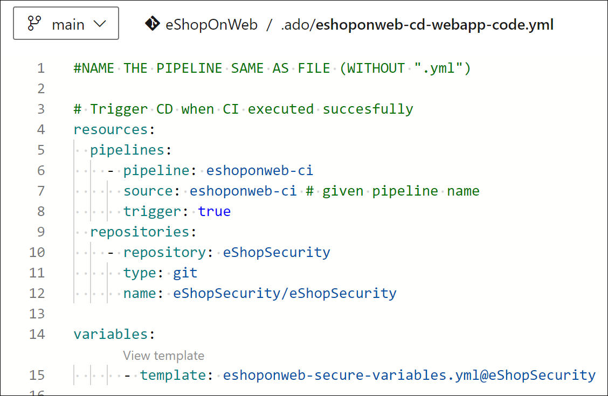

---
lab:
  title: Configurar uma estrutura de repositório e projeto para dar suporte a pipelines seguros
  module: 'Module 1: Configure a project and repository structure to support secure pipelines'
---

# Configurar uma estrutura de repositório e projeto para dar suporte a pipelines seguros

Neste laboratório, você vai aprender a configurar uma estrutura de repositório e projeto no Azure DevOps para dar suporte a pipelines seguros. Este laboratório aborda as práticas recomendadas para organizar projetos e repositórios, atribuir permissões e gerenciar arquivos seguros.

Estes exercícios levam aproximadamente **30** minutos.

## Antes de começar

Você precisará de uma assinatura do Azure, da organização do Azure DevOps e do aplicativo eShopOnWeb para acompanhar os laboratórios.

- Siga as etapas para [validar seu ambiente de laboratório](APL2001_M00_Validate_Lab_Environment.md).

## Instruções

### Exercício 1: configurar uma estrutura de projeto segura

Neste exercício, você configurará uma estrutura de projeto segura criando um novo projeto e atribuindo permissões de projeto à estrutura. Separar responsabilidades e recursos em diferentes projetos ou repositórios com permissões específicas oferece suporte à segurança.

#### Tarefa 1: criar uma nova equipe de projeto

1. Navegue até o portal do Azure DevOps em `https://dev.azure.com` e abra sua organização.

1. Abra as **configurações da organização** no canto inferior esquerdo do portal e, em seguida, **Projetos** na seção Geral.

1. Selecione a opção **Novo projeto** e use as seguintes configurações:

   - nome: **eShopSecurity**
   - visibilidade: **Particular**
   - Avançado: Controle de Versão: **Git**
   - Avançado: Processo de Item de Trabalho: **Scrum**

   

1. Selecione **Criar** para criar o projeto.

1. Agora é possível alternar entre os diferentes projetos clicando no ícone do Azure DevOps no canto superior esquerdo do portal do Azure DevOps.

   

É possível gerenciar permissões e configurações para cada projeto separadamente acessando o menu Configurações do projeto e selecionando o projeto de equipe apropriado. Se você tiver vários usuários ou equipes trabalhando em projetos diferentes, também poderá atribuir permissões a cada projeto separadamente.

#### Tarefa 2: criar um novo repositório e atribuir permissões de projeto

1. Selecione o nome da organização no canto superior esquerdo do portal Azure DevOps e selecione o novo projeto **eShopSecurity**.

1. Selecione o menu **Repos**.

1. Selecione o botão **Inicializar** para inicializar o novo repositório adicionando o arquivo README.md.

1. Abra o menu **Configurações do projeto** no canto inferior esquerdo do portal e selecione **Repositórios** na seção Repos.

1. Selecione o novo repositório **eShopSecurity** e selecione a guia **Segurança**.

1. Remova as permissões Herdar do pai desmarcando o botão de alternância **Herança**.

1. Selecione o grupo **Colaboradores** e selecione o menu suspenso **Negar** para todas as permissões, exceto **Leitura**. Isso impedirá que todos os usuários do grupo de Colaboradores acessem o repositório.

1. Selecione seu usuário em Usuários e selecione o botão **Permitir** para permitir todas as permissões.

   > [!NOTE]
   > Se você não vir seu nome na seção **Usuários**, insira seu nome na caixa de texto **Pesquisar por usuários ou grupos** e selecione-o na lista de resultados.

   

1. As alterações vão ser salvas automaticamente.

Agora, apenas o usuário que você atribuiu permissões e os administradores podem acessar o repositório. Isso é útil quando você deseja permitir que usuários específicos acessem o repositório e executem pipelines a partir do projeto eShopOnWeb.

### Exercício 2: configurar uma estrutura de pipeline e modelo para oferecer suporte a pipelines seguros

#### Tarefa 1: importar e executar o pipeline de CI

1. Navegue até o portal do Azure DevOps em `https://dev.azure.com` e abra sua organização.

1. Abra o projeto **eShopOnWeb** no Azure DevOps.

1. Acesse **Pipelines > Pipelines**.

1. Selecione o botão **Criar pipeline**.

1. Selecione **Git do Azure Repos (Yaml)**.

1. Selecione o repositório **eShopOnWeb**.

1. Selecione **Arquivo YAML existente do Azure Pipelines**.

1. Selecione o arquivo **/.ado/eshoponweb-ci.yml** e selecione **Continuar**.

1. Clique no botão **Executar** para executar o pipeline.

   > [!NOTE]
   > Seu pipeline assumirá um nome com base no nome do projeto. Você o renomeará para facilitar a identificação do pipeline.

1. Vá para **Pipelines > Pipelines** e selecione o pipeline criado recentemente. Selecione as reticências e, em seguida, selecione a opção **Renomear/mover**.

1. Nomeie-o **eshoponweb-ci** e selecione **Salvar**.

#### Tarefa 2: importar e executar o pipeline de CD

1. Acesse **Pipelines > Pipelines**.

1. Selecione o botão **Novo pipeline**.

1. Selecione **Git do Azure Repos (Yaml)**.

1. Selecione o repositório **eShopOnWeb**.

1. Selecione **Arquivo YAML existente do Azure Pipelines**.

1. Selecione o arquivo **/.ado/eshoponweb-cd-webapp-code.yml** e selecione **Continuar**.

1. Na definição de pipeline YAML na seção variáveis, personalize:

   - **AZ400-EWebShop-NAME** com o nome de sua preferência, por exemplo, **rg-eshoponweb-secure**.
   - **Local** com o nome da região do Azure que você deseja implantar seus recursos, por exemplo, **southcentralus**.
   - **YOUR-SUBSCRIPTION-ID** com sua ID de assinatura do Azure.
   - **az400-webapp-NAME** por um nome globalmente exclusivo do aplicativo Web a ser implantado, por exemplo, a cadeia de caracteres **eshoponweb-lab-secure-** seguida por um número aleatório de seis dígitos. 

1. Selecione **Salvar e executar** e escolha fazer commit diretamente na ramificação principal.

1. Selecione **Salvar e executar** novamente.

1. Abra a execução de pipeline. Se você vir a mensagem "Este pipeline precisa de permissão para acessar um recurso antes que essa execução possa continuar a Implantar no WebApp", selecione **Exibir**, **Permitir** e **Permitir** novamente. Isso é necessário para permitir que o pipeline crie o recurso do Serviço de Aplicativo do Azure.

   

1. A implantação pode levar alguns minutos para ser concluída, aguarde a execução do pipeline. O pipeline é disparado após a conclusão do pipeline de CI e inclui as seguintes tarefas:

   - **AzureResourceManagerTemplateDeployment**: Implanta o aplicativo Web do Serviço de Aplicativo do Azure usando o modelo bicep.
   - **AzureRmWebAppDeployment**: Publica o site no aplicativo Web do Serviço de Aplicativo do Azure.

1. Seu pipeline assumirá um nome com base no nome do projeto. Vamos renomeá-lo para identificar melhor o pipeline.

1. Vá para **Pipelines > Pipelines** e selecione o pipeline criado recentemente. Selecione as reticências e, em seguida, selecione a opção **Renomear/mover**.

1. Nomeie-o **eshoponweb-cd-webapp-code** e selecione **Salvar**.

Agora você deve ter dois pipelines em execução em seu projeto eShopOnWeb.


#### Tarefa 3: Mover as variáveis de pipeline de CD para um modelo de YAML

Nesta tarefa, você criará um modelo YAML para armazenar as variáveis usadas no pipeline de CD. Isso permitirá que você reutilize o modelo em outros pipelines.

1. Vá para **Repos** e, em seguida, **Arquivos**.

1. Expanda a pasta **.ado** e selecione **Novo arquivo**.

1. Nomeie o arquivo **eshoponweb-secure-variables.yml** e selecione **Criar**.

1. Adicione a seção de variáveis usada no pipeline do CD ao novo arquivo. O arquivo deverá ter a seguinte aparência:

   ```yaml
   variables:
     resource-group: 'rg-eshoponweb-secure'
     location: 'southcentralus' #the name of the Azure region you want to deploy your resources
     templateFile: '.azure/bicep/webapp.bicep'
     subscriptionid: 'YOUR-SUBSCRIPTION-ID'
     azureserviceconnection: 'azure subs' #the name of the service connection to your Azure subscription
     webappname: 'eshoponweb-lab-secure-XXXXXX' #the globally unique name of the web app
   ```

   > [!IMPORTANT]
   > Substitua os valores das variáveis pelos valores do seu ambiente (grupo de recursos, local, ID da assinatura, conexão de serviço do Azure e nome do aplicativo Web).

1. Selecione **Confirmar**, na caixa de texto de comentário de confirmação, insira `[skip ci]` e selecione **Confirmar**.

   > [!NOTE]
   > Ao adicionar o comentário `[skip ci]` ao confirmar, você impedirá a execução automática do pipeline, que, neste ponto, é executado por padrão após cada alteração no repositório. 

1. Na lista de arquivos no repositório, abra a definição de pipeline **eshoponweb-cd-webapp-code.yml** e substitua a seção de variáveis pelo seguinte:

   ```yaml
   variables:
     - template: eshoponweb-secure-variables.yml
   ```

1. Selecione **Confirmar**, aceite o comentário padrão e selecione **Confirmar** para executar o pipeline novamente.

1. Verifique se a execução do pipeline foi concluída com êxito. 

Agora você tem um modelo YAML com as variáveis usadas no pipeline de CD. Você pode reutilizar esse modelo em outros pipelines em cenários em que você precisa implantar os mesmos recursos. Além disso, sua equipe de operações pode controlar o grupo de recursos e o local onde os recursos são implantados e outras informações em seus valores de modelo e você não precisará fazer nenhuma alteração na definição do pipeline.

#### Tarefa 4: Mover os modelos de YAML para um repositório e um projeto separados

Nesta tarefa, você moverá os modelos YAML para um repositório e projeto separados.

1. No seu projeto eShopSecurity, vá para **Repos > Arquivos**.

1. Crie um novo arquivo chamado **eshoponweb-secure-variables.yml**.

1. Copie o conteúdo do arquivo **.ado/eshoponweb-secure-variables.yml** do repositório eShopOnWeb para o novo arquivo.

1. Confirme as alterações.

1. Abra a definição de pipeline**eshoponweb-cd-webapp-code.yml** no repositório do eShopOnWeb.

1. Adicione o seguinte à seção de recursos:

   ```yaml
     repositories:
       - repository: eShopSecurity
         type: git
         name: eShopSecurity/eShopSecurity #name of the project and repository
   ```

1. Substitua a seção variáveis pelo conteúdo a seguir:

   ```yaml
   variables:
     - template: eshoponweb-secure-variables.yml@eShopSecurity #name of the template and repository
   ```

   

1. Selecione **Confirmar**, aceite o comentário padrão e selecione **Confirmar** para executar o pipeline novamente.

1. Navegue até a execução do pipeline e verifique se o pipeline está usando o arquivo YAML do repositório eShopSecurity.

   

Agora você tem o arquivo YAML em um repositório e projeto separados. Reutilize esse arquivo em outros pipelines em cenários em que precisa implantar os mesmos recursos. Além disso, sua equipe de operações poderá controlar o grupo de recursos, o local, a segurança, onde os recursos são implantados, e outras informações, modificando valores no arquivo YAML e não precisará fazer nenhuma alteração na definição do pipeline.

### Exercício 2: executar a limpeza dos recursos do Azure e do Azure DevOps

Neste exercício, você removerá os recursos do Azure e do Azure DevOps criados neste laboratório.

#### Tarefa 1: remover recursos do Azure

1. No portal do Azure, navegue até o grupo de recursos **rg-eshoponweb-secure** que contém recursos implantados e selecione **Excluir grupo de recursos**, para excluir todos os recursos criados neste laboratório.

   

   > [!WARNING]
   > Lembre-se sempre de remover todos os recursos do Azure que você não usa mais. Remover recursos não utilizados garante que você não veja encargos inesperados.

#### Tarefa 2: remover pipelines do Azure DevOps

1. Navegue até o portal do Azure DevOps em `https://dev.azure.com` e abra sua organização.

1. Abra o projeto **eShopOnWeb**.

1. Acesse **Pipelines > Pipelines**.

1. Acesse **Pipelines > Pipelines** e exclua os pipelines existentes.

#### Tarefa 3: Criar novamente o repositório do Azure DevOps

1. No portal do Azure DevOps, no projeto **eShopOnWeb**, selecione **Configurações do projeto** no canto inferior esquerdo.

1. No menu vertical **Configurações do projeto** no lado esquerdo, na seção **Repositórios**, selecione **Repositórios**.

1. No painel **Todos os Repositórios**, passe o mouse sobre a extremidade direita da entrada do repositório do **eShopOnWeb** até que o ícone de reticências **Mais opções** apareça. Selecione-o e, no menu **Mais opções**, selecione **Renomear**.  

1. Na janela **Renomear o repositório eShopOnWeb**, na caixa de texto **Nome do repositório**, insira **eShopOnWeb_old** e selecione **Renomear**.

1. De volta ao painel **Todos os Repositórios**, selecione **+ Criar**.

1. No painel **Criar um repositório**, na caixa de texto **Nome do repositório**, insira **eShopOnWeb**, desmarque a caixa de seleção **Adicionar um LEIAME** e selecione **Criar**.

1. De volta ao painel **Todos os Repositórios**, passe o mouse sobre a extremidade direita da entrada do repositório **eShopOnWeb_old** até que o ícone de reticências **Mais opções** apareça. Selecione-o e, no menu **Mais opções**, selecione **Excluir**.  

1. Na janela **Excluir o repositório eShopOnWeb_old**, insira **eShopOnWeb_old** e selecione **Excluir**.

1. No menu de navegação esquerdo do portal do Azure DevOps, selecione **Repositórios**.

1. No painel o **eShopOnWeb está vazio. Adicione algum código!** no painel, selecione **Importar um repositório**.

1. Na janela **Importar um repositório do Git**, cole a seguinte URL `https://github.com/MicrosoftLearning/eShopOnWeb` e selecione **Importar**:

## Revisão

Neste laboratório, você aprendeu a configurar e organizar uma estrutura segura de repositório e projeto no Azure DevOps. Ao gerenciar permissões de forma eficaz, você pode garantir que os usuários certos tenham acesso aos recursos de que precisam e, ao mesmo tempo, manter a segurança e a integridade de seus pipelines e processos de DevOps.
