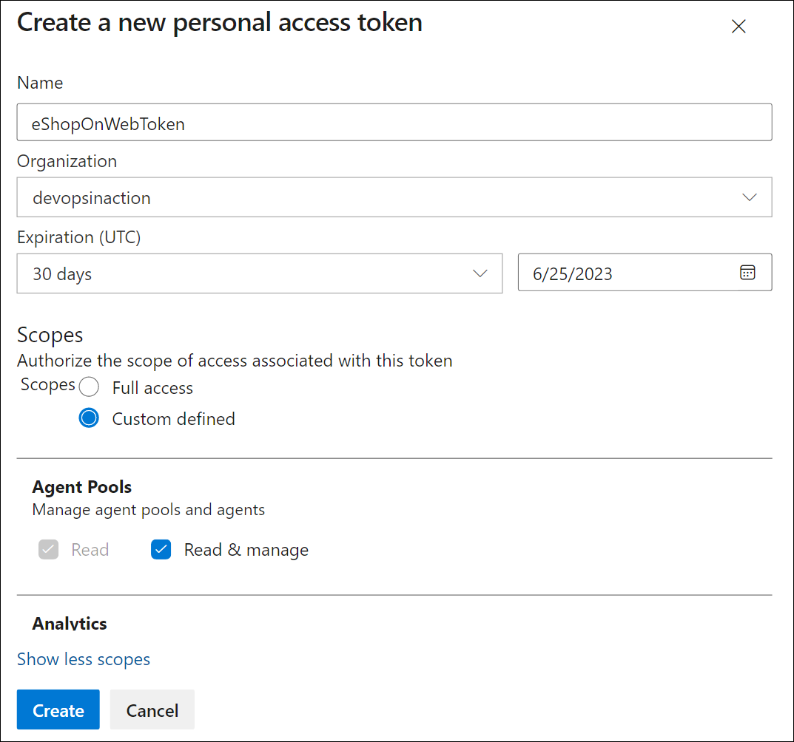

---
lab:
  title: Configurar agentes e pools de agentes para pipelines seguros
  module: 'Module 2: Configure secure access to pipeline resources'
---

# Configurar agentes e pools de agentes para pipelines seguros

Neste laboratório, você vai aprender a configurar agentes e pools de agentes do Azure DevOps e a gerenciar permissões para esses pools. Os Pools de Agentes do Azure DevOps fornecem os recursos para executar seus pipelines de build e lançamento.

Estes exercícios levam aproximadamente **25** minutos.

## Antes de começar

Você precisará de uma assinatura do Azure, da organização do Azure DevOps e do aplicativo eShopOnWeb para acompanhar os laboratórios.

- Siga as etapas para [validar seu ambiente de laboratório](APL2001_M00_Validate_Lab_Environment.md).

## Instruções

Você criará agentes e configurará agentes auto-hospedados usando o Windows. Se você quiser configurar agentes no Linux ou MacOS, siga as instruções na [documentação do Azure DevOps](https://docs.microsoft.com/azure/devops/pipelines/agents/v2-linux).

Durante a configuração, tenha em mente o seguinte:

- **Manter agentes separados por projeto**: cada agente só pode ser vinculado a um pool. Embora o compartilhamento de pools de agentes entre projetos possa economizar nos custos de infraestrutura, ele também cria o risco de movimentação lateral. Portanto, é melhor ter pools de agentes separados com agentes dedicados para cada projeto para evitar a contaminação cruzada.
- **Utilize contas com privilégios baixos para executar agentes**: executar um agente com uma identidade com acesso direto aos recursos do Azure DevOps pode representar ameaças à segurança. Operar o agente em uma conta local não privilegiada, como o Serviço de Rede, é aconselhável, o que minimiza o risco.
- **Cuidado com nomes de grupo enganosos**: o grupo "Contas de Serviço de Coleta de Projeto" no Azure DevOps é um risco potencial à segurança. A execução de agentes usando uma identidade que faz parte desse grupo e é apoiada pelo Azure AD pode comprometer a segurança de toda a sua organização do Azure DevOps.
- **Evite contas com privilégios altos para agentes auto-hospedados**: o uso de contas com privilégios altos para executar agentes auto-hospedados, especialmente para acessar segredos ou ambientes de produção, pode expor seu sistema a ameaças graves se um pipeline for comprometido.
- **Priorize a segurança**: para proteger seus sistemas, use a conta com menos privilégios para executar agentes auto-hospedados. Por exemplo, considere usar sua conta de computador ou uma identidade de serviço gerenciado. Também é aconselhável permitir que o Azure Pipelines manipule o acesso a segredos e ambientes.

### Exercício 1: criar agentes e configurar pools de agentes

Neste exercício, você criará uma VM (máquina virtual) do Azure e a usará para criar um agente e configurar pools de agentes.

#### Tarefa 1: Criar e conectar-se a uma VM do Azure

1. No seu navegador, abra o portal do Azure em `https://portal.azure.com`. Se solicitado, entre usando uma conta com a função Proprietário em sua assinatura do Azure.

1. Na caixa **Pesquisar recursos, serviços e documentos (G+/),** digite **Máquinas virtuais** e selecione na lista suspensa.

1. Selecione o botão **Criar**.

1. Selecione **Máquina virtual do Azure com uma configuração predefinida**.

    

1. Selecione **Desenvolvimento/Teste** como o ambiente de carga de trabalho e **Uso Geral** como o tipo de carga de trabalho.

1. Selecione o botão **Continuar a criar uma VM**, na guia **Noções básicas**, execute as seguintes ações e selecione **Gerenciamento**:

   | Configuração | Ação |
   | -- | -- |
   | Lista suspensa **Assinatura** | Selecione sua assinatura do Azure. |
   | Seção **Grupo de recursos** | Crie um novo grupo de recursos chamado **rg-eshoponweb-agentpool**. |
   | Caixa de texto **Nome da máquina virtual**  | Insira o nome de sua preferência, por exemplo, **eshoponweb-vm**. |
   | Lista suspensa **Região** | Selecione a mesma região do Azure usada anteriormente neste laboratório. |
   | Lista suspensa **Opções de disponibilidade** | Selecione **Nenhuma redundância de infraestrutura necessária**. |
   | Lista suspensa **Tipos de segurança** | Selecione a opção **Máquinas virtuais de inicio confiável**. |
   | Lista suspensa **Imagem** | Selecione o **Datacenter do Windows Server 2022: imagem Edição do Azure – x64 Gen2**. |
   | Lista suspensa **Tamanho** | Selecione o tamanho**Padrão** mais econômico para fins de teste. |
   | Caixa de texto **Nome de usuário** | Digite o nome de usuário de sua preferência |
   | Caixa de texto **Senha** | Digite a senha de sua preferência |
   | Seção **Portas de entrada públicas** | Selecione **Permitir portas selecionadas**. |
   | Lista suspensa **Selecionar portas de entrada** | Selecione **RDP (3389)**. |

1. Na guia **Gerenciamento**, na seção **Identidade**, selecione a caixa de seleção **Habilitar identidade gerenciada atribuída pelo sistema** e selecione **Examinar + criar**:

1. Na guia **Revisar + criar**, selecione **Criar**.

   > [!NOTE]
   > Aguarde o processo de provisionamento ser concluído. Isso deverá levar cerca de dois minutos.

1. No portal do Azure, navegue até a página exibindo a configuração da VM do Azure recém-criada. 

1. Na página da VM do Azure, selecione **Conectar**, no menu suspenso, selecione **Conectar** e, em seguida, selecione **Baixar arquivo RDP** e use o arquivo RDP baixado para estabelecer uma sessão de Área de Trabalho Remota para o sistema operacional em execução na VM do Azure.

#### Tarefa 2: Criar um pool de agentes

1. Na sessão da Área de Trabalho Remota para a VM do Azure, inicie o navegador da Web do Microsoft Edge.

1. No navegador da Web, navegue até o portal do Azure DevOps em `https://dev.azure.com` e entre para acessar sua organização.

1. Abra o projeto **eShopOnWeb** e selecione **Configurações do projeto** no menu inferior esquerdo.

1. Em **Pipelines > Pools de agentes**, selecione o botão **Adicionar pool**.

1. Escolha o tipo de pool **Auto-hospedado**.

1. Forneça um nome para o pool de agentes, como **eShopOnWebSelfPool**, e adicione uma descrição opcional.

1. Deixe a opção **Conceder permissão de acesso a todos os pipelines** desmarcada.

   

1. Selecione o botão **Criar** para criar o pool de agentes.

#### Tarefa 3: Baixar e extrair os arquivos de instalação do agente

1. No portal do Azure DevOps, selecione o pool de agentes recém-criado e, em seguida, selecione a guia **Agentes**.

1. Selecione o botão **Novo agente** e, em seguida, o botão **Baixar** em **Baixar agente** na nova janela pop-up.

   > [!NOTE]
   > Siga as instruções de instalação para instalar o agente.

1. Inicie uma sessão do PowerShell e execute os comandos a seguir para criar um **agente** nomeado de pasta.

   ```powershell
   mkdir agent ; cd agent        
   ```

   > [!NOTE]
   > Verifique se você está na pasta raiz do seu perfil de usuário ou na pasta onde deseja instalar o agente.

1. Execute o seguinte comando para extrair o conteúdo dos arquivos do instalador do agente baixado:

   ```powershell
   Add-Type -AssemblyName System.IO.Compression.FileSystem ; [System.IO.Compression.ZipFile]::ExtractToDirectory("$HOME\Downloads\vsts-agent-win-x64-3.232.0.zip", "$PWD")
   ```

   > [!NOTE]
   > Se você baixou o agente para um local diferente (ou a versão baixada difere), ajuste o comando acima adequadamente.

#### Tarefa 4: Criar um token PAT

> [!NOTE]
> Antes de configurar o agente, você precisa criar um token PAT (a menos que tenha um existente). Para criar um token PAT, siga as etapas abaixo:

1. Na sessão da Área de Trabalho Remota para a VM do Azure, abra outra janela do navegador, navegue até o portal do Azure DevOps em `https://dev.azure.com` e acesse sua organização.

1. Selecione **Configurações do usuário** no menu superior direito (diretamente à esquerda do ícone de avatar do usuário).

1. Selecione o item de menu **Tokens de acesso pessoal**.

   

1. Selecione o botão **Novo Token**.

1. Forneça um nome para o token, como **eShopOnWebToken**.

1. Selecione a organização do Azure DevOps para a qual você deseja usar o token.

1. Defina a data de validade do token (usado apenas para configurar o agente).

1. Selecione o escopo personalizado definido.

1. Selecione para mostrar todos os escopos.

1. Selecione o escopo **Pools de Agentes (Ler e Gerenciar)**.

1. Selecione o botão **Criar** para criar o token.

1. Copie o valor do token e salve-o em um local seguro (você não poderá vê-lo novamente. Você só pode regenerar o token).

   

   > [!IMPORTANT]
   > Use a opção de privilégio mínimo, **Pools de Agentes (Ler &Gerenciar)**, somente para a configuração do agente. Além disso, certifique-se de definir a data de validade mínima para o token se essa for a única finalidade do token. Você pode criar outro token com os mesmos privilégios se precisar configurar o agente novamente.

#### Tarefa 5: Configurar o agente

1. Na sessão da Área de Trabalho Remota para a VM do Azure, volte para a janela do PowerShell. Se necessário, altere o diretório atual para aquele no qual você extraiu os arquivos de instalação do agente anteriormente neste exercício. 

1. Para configurar o agente para ser executado sem vigilância, invoque o seguinte comando:

   ```powershell
   .\config.cmd
   ```

   > [!NOTE]
   > Se você quiser executar o agente interativamente, use `.\run.cmd`. 

1. Para configurar o agente, execute as seguintes ações quando solicitado:

   - Insira a URL da organização do Azure DevOps (**URL do servidor**) no formato `https://dev.azure.com/`{nome da sua organização}.
   - Aceite o tipo de autenticação padrão (**PAT**).
   - Insira o valor do token PAT que você criou na etapa anterior.
   - Insira o nome do pool de agentes **eShopOnWebSelfPool** que você criou anteriormente neste exercício.
   - Digite o nome do agente **eShopOnWebSelfAgent**.
   - Aceite a pasta de trabalho do agente padrão (_work).
   - Insira **Y** para configurar o agente a ser executado como serviço.
   - Insira **Y** para habilitar SERVICE_SID_TYPE_UNRESTRICTED para o serviço do agente.
   - Insira **NT AUTHORITY\SYSTEM** para definir o contexto de segurança do serviço.

   > [!IMPORTANT]
   > Em geral, você deve seguir o princípio do privilégio mínimo ao configurar o contexto de segurança do serviço.

   - Aceite a opção padrão (**N**) para permitir que o serviço seja iniciado imediatamente após a conclusão da configuração.

   

1. Verifique o status do agente alternando para o navegador da Web exibindo o portal do Azure DevOps, navegando até o pool de agentes e clicando na guia **Agentes**. Você deve ver o novo agente na lista.

   

   > [!NOTE]
   > Para obter mais detalhes sobre agentes do Windows, consulte: [Agentes do Windows auto-hospedados](https://learn.microsoft.com/azure/devops/pipelines/agents/windows-agent)

   > [!IMPORTANT]
   > Para que o agente possa criar e implantar recursos do Azure a partir dos pipelines do Azure DevOps (que você percorrerá nos próximos laboratórios), é necessário instalar a CLI do Azure no sistema operacional da VM do Azure que está hospedando o agente.

1. Inicie um navegador da Web e navegue até a página [Instalar a CLI do Azure no Windows](https://learn.microsoft.com/en-us/cli/azure/install-azure-cli-windows?tabs=azure-cli#install-or-update).

1. Baixe e instale a CLI do Azure. 

1. No navegador da Web, navegue até a página do instalador do SDK do Microsoft .NET 7.0 em `https://dotnet.microsoft.com/en-us/download/dotnet/thank-you/sdk-7.0.404-windows-x64-installer`.

1. Baixe e instale o Microsoft .NET 7.0 SDK.

### Exercício 2: Criar e configurar a segurança do pool de agentes

Neste exercício, você configurará a segurança para o pool de agentes.

#### Tarefa 1: criar um novo grupo de segurança

1. Na sessão da Área de Trabalho Remota para a VM do Azure, no navegador da Web que exibe o portal do Azure DevOps, no painel **Configurações do Projeto**, na seção **Geral**, selecione **Permissões **.

1. Selecione o botão **Novo Grupo**.

1. Forneça um nome para o grupo, como **Grupo de Segurança eShopOnWeb**.

1. Selecione o botão **Criar** para criar o grupo.

   

#### Tarefa 2: configurar o grupo de segurança

1. Na janela do navegador da Web que exibe o portal do Azure Devops, selecione o novo grupo para exibir sua guia **Permissões**.

1. Negar permissões desnecessárias para o grupo, como **Renomear projeto de equipe**, **Excluir permanentemente itens de trabalho** ou quaisquer outras permissões que você não deseja que o grupo tenha, pois presumimos que ele será usado apenas para o pool de agentes.

   

   > [!IMPORTANT]
   > Se você deixar permissões que não deseja no grupo, scripts ou tarefas em execução no agente poderão usar as permissões de grupo para executar ações que você não deseja que eles executem.

#### Tarefa 3: Gerenciar permissões do pool de agentes

Nesta tarefa, você gerenciará permissões para o pool de agentes.

1. Na janela do navegador da Web exibindo o portal do Azure Devops, nas **Configurações de Projeto** do projeto **eShopOnWeb**, na seção **Pipelines**, selecione **Pools do Agente**.

1. Selecione o pool de agentes **eShopOnWebSelfPool**.

1. Na exibição de detalhes do pool de agentes, selecione a guia **Segurança**.

1. Selecione o botão **Adicionar** e adicione o novo grupo **Grupo de Segurança eShopOnWeb** às permissões de usuário do pool de agentes.

1. Escolha a função apropriada para o usuário ou grupo, como Leitor do Pool de Agentes, Usuário ou Administrador. Nesse caso, escolha **Usuário**.

1. Selecione **Adicionar** para aplicar as permissões.

   

Agora você está pronto para usar com segurança o pool de agentes em seus pipelines. Para obter mais detalhes sobre pools de agentes, consulte: [Pools de agentes](https://learn.microsoft.com/azure/devops/pipelines/agents/pools-queues).

### Exercício 4: Executar a limpeza dos recursos do Azure e do Azure DevOps

Neste exercício, você executará a limpeza pós-laboratório de alguns dos recursos do Azure DevOps criados neste laboratório.

#### Tarefa 1: Parar e desalocar a VM do Azure

> [!NOTE]
> Você usará a VM do Azure criada neste laboratório no próximo laboratório. Portanto, em vez de excluí-la, você a interromperá e desalocará para eliminar seus encargos de computação.

1. No portal do Azure, navegue até a página exibindo a VM do Azure **eshoponweb-vm** que você implantou neste laboratório

1. Na página da VM do Azure **eshoponweb-vm**, na barra de ferramentas, selecione **Parar** para pará-la e desalocá-la.

#### Tarefa 2: Remover recursos do Azure DevOps

> [!NOTE]
> Você usará o agente auto-hospedado criado neste laboratório no próximo laboratório, portanto, em vez de excluí-lo, você só revogará o Token de Acesso Pessoal usado para configurá-lo. Isso não o impedirá de ser executado posteriormente.

1. No portal do Azure DevOps, selecione **Configurações de usuário** no menu superior direito (diretamente à esquerda do ícone de avatar do usuário).

1. Selecione o item de menu **Tokens de acesso pessoal**.

   

1. Selecione a entrada **eShopOnWebToken**. 

1. Selecione **Revogar** e, quando solicitado a confirmar, selecione **Revogar** novamente.

## Revisão

Neste laboratório, saiba como configurar um agente auto-hospedado e pools de agentes do Azure DevOps e gerenciar permissões para esses pools. Ao gerenciar permissões de forma eficaz, você pode garantir que os usuários certos tenham acesso aos recursos de que precisam e, ao mesmo tempo, manter a segurança e a integridade de seus processos de DevOps.
