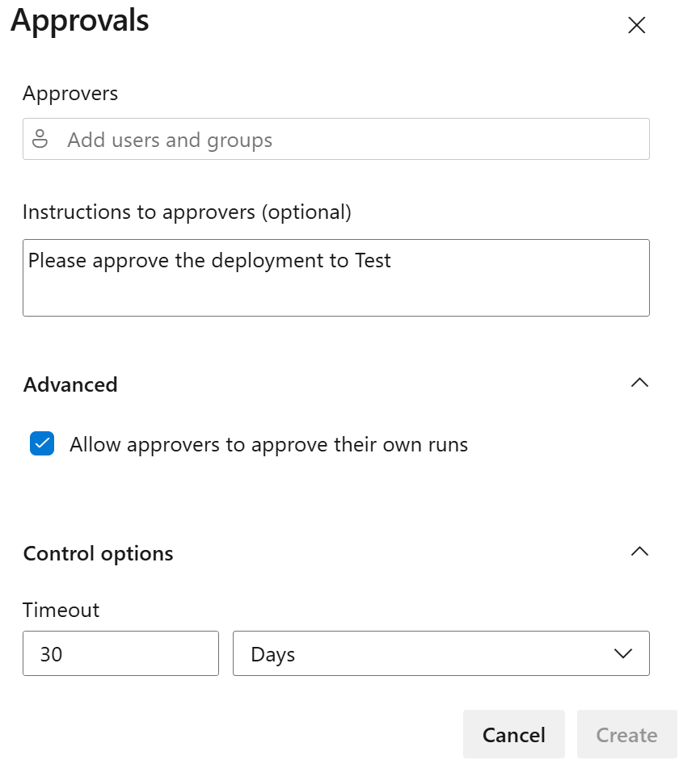
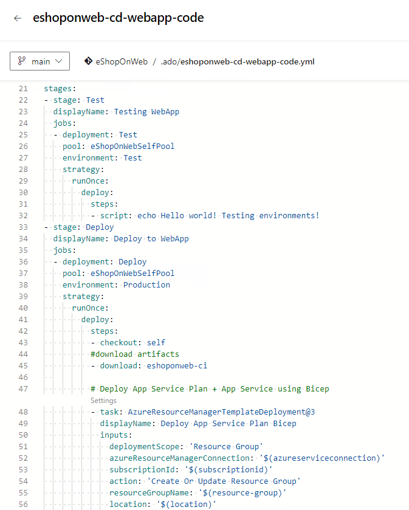
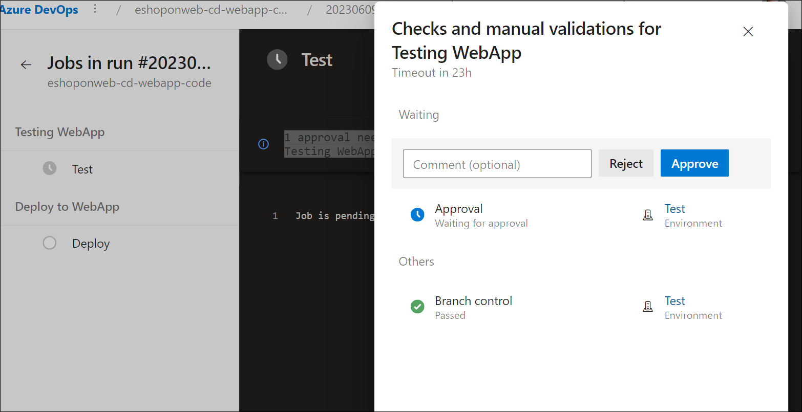
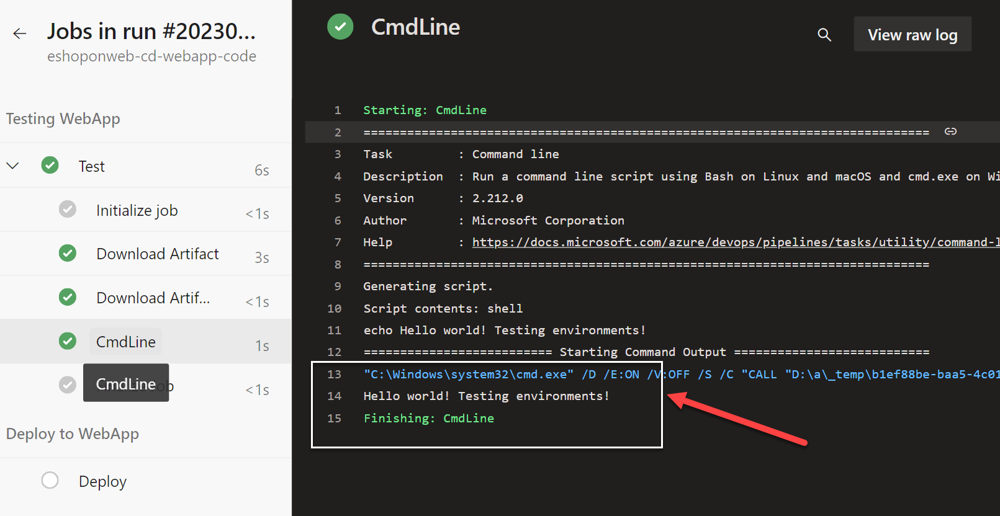

---
lab:
  title: Configurar e validar permissões
  module: 'Module 4: Configure and validate permissions'
---

# Configurar e validar permissões

Neste laboratório, você vai configurar um ambiente seguro que adere ao princípio de privilégios mínimos, garantindo que os membros possam acessar apenas os recursos necessários para executar suas tarefas e minimizar possíveis riscos de segurança. Isso envolve configurar e validar permissões de usuário e pipeline e configurar verificações de aprovação e branch no Azure DevOps.

Estes exercícios levam aproximadamente **30** minutos.

## Antes de começar

Você precisará de uma assinatura do Azure, da organização do Azure DevOps e do aplicativo eShopOnWeb para acompanhar os laboratórios.

- Siga as etapas para [validar seu ambiente de laboratório](APL2001_M00_Validate_Lab_Environment.md).
- Instale um agente auto-hospedado seguindo o laboratório [Configurar agentes e pools de agentes para pipelines seguros](/Instructions/Labs/APL2001_M03_L03_Configure_Agents_And_Agent_Pools_for_Secure_Pipelines.md) ou as etapas em [Instalar um agente auto-hospedado](https://docs.microsoft.com/azure/devops/pipelines/agents/v2-windows?view=azure-devops#install).

## Instruções

### Exercício 1: importar o pipeline de CI e configurar permissões específicas de pipeline

Neste exercício, você importará e executará o pipeline de CI para o aplicativo eShopOnWeb e configurará permissões específicas de pipeline.

#### Tarefa 1:  Importar e executar o pipeline de CI

> [!NOTE]
> Comece importando o pipeline de CI chamado [eshoponweb-ci.yml](https://github.com/MicrosoftLearning/eShopOnWeb/blob/main/.ado/eshoponweb-ci.yml).

1. Navegue até o portal do Azure DevOps em `https://dev.azure.com` e abra sua organização.

1. Abra o projeto **eShopOnWeb**.

1. Acesse **Pipelines > Pipelines**.

1. Selecione **Novo Pipeline**.

1. Selecione **Git do Azure Repos (Yaml)**.

1. Selecione o repositório **eShopOnWeb**.

1. Selecione **Arquivo YAML existente do Azure Pipelines**.

1. Selecione o arquivo **/.ado/eshoponweb-ci.yml** e selecione **Continuar**.

1. Clique no botão **Executar** para executar o pipeline.

   > [!NOTE]
   > Seu pipeline assumirá um nome com base no nome do projeto. Renomeie-o para identificar melhor o pipeline.

1. Vá para **Pipelines > Pipelines**, selecione o pipeline criado recentemente, selecione as reticências e selecione a opção **Renomear/mover**.

1. Nomeie-o **eshoponweb-ci** e selecione **Salvar**.

#### Tarefa 2: configurar e executar o pipeline com permissões específicas

> [!NOTE]
> Para usar o pool de agentes configurado nesta tarefa, primeiro você precisará iniciar a VM do Azure que hospeda o agente. 

1. No seu navegador, abra o portal do Azure em `https://portal.azure.com`.

1. No portal do Azure, navegue até a página exibindo a VM do Azure **eshoponweb-vm** implantada neste laboratório

1. Na página da VM do Azure **eshoponweb-vm**, na barra de ferramentas, selecione **Iniciar** para iniciá-la.

   > [!NOTE]
   > Em seguida, você configurará o pipeline de CI para ser executado com o pool de agentes correspondente e validará as permissões para executar o pipeline. Você precisa ter permissões para editar o pipeline e adicionar permissões ao pool de agentes.

1. Acesse as Configurações do Projeto e clique em **Pools de Agentes** em **Pipelines**.

1. Abra o pool de agentes **eShopOnWebSelfPool**.

1. Selecione a guia **Segurança**.

1. Na seção **Permissões de pipeline**, selecione o botão **+** e selecione o pipeline **eshoponweb-ci** para adicioná-lo à lista de pipelines com acesso ao pool de agentes.

1. Navegue até a página do projeto **eShopOnWeb**.

1. Na página do projeto **eShopOnWeb**, navegue até **Pipelines > Pipelines**.

1. Selecione o pipeline **eshoponweb-ci** e selecione **Editar**.

1. Na subseção **trabalhos** da seção **estágios**, atualize o valor da propriedade **pool** para fazer referência ao pool de agentes auto-hospedado **eShopOnWebSelfPool** configurado nesta tarefa para que ele tem o seguinte formato:

   ```yaml
     jobs:
     - job: Build
       pool: eShopOnWebSelfPool
       steps:
       - task: DotNetCoreCLI@2
   ```

1. Selecione **Salvar** e escolha confirmar diretamente no branch principal.

1. Selecione **Salvar** novamente.

1. Selecione **Executar** o pipeline e clique em **Executar** novamente.

1. Verifique se o trabalho de compilação está em execução no agente **eShopOnWebSelfAgent** e ele é concluído com êxito.

#### Tarefa 3: Configurar o pipeline de CD e validar permissões

1. No portal do Azure DevOps, na página do projeto **eShopOnWeb**, acesse **Pipelines > Pipelines**.

1. Selecione **Novo pipeline**.

1. Selecione **Git do Azure Repos (Yaml)**.

1. Selecione o repositório **eShopOnWeb**.

1. Selecione **Arquivo YAML existente do Azure Pipelines**.

1. Selecione o arquivo **/.ado/eshoponweb-cd-webapp-code.yml** e selecione **Continuar**.

1. Na definição de pipeline YAML, na seção de variáveis, personalize:

   - **AZ400-EWebShop-NAME** com o nome de sua preferência, por exemplo, **rg-eshoponweb-perm**.
   - **Local** com o nome da região do Azure que você deseja implantar seus recursos, por exemplo, **southcentralus**.
   - **YOUR-SUBSCRIPTION-ID** com sua ID de assinatura do Azure.
   - **azure subs** com **azure subs gerenciados**
   - **az400-webapp-NAME** com um nome global exclusivo do aplicativo Web a ser implantado, por exemplo, a cadeia de caracteres **eshoponweb-lab-perm-** seguida por um número aleatório de seis dígitos. 

1. Atualize o arquivo YAML para usar o pool de agentes **eShopOnWebSelfPool**. Para fazer isso, defina a seção do **pool** com o seguinte valor:

   ```yaml
     jobs:
     - job: Deploy
       pool: eShopOnWebSelfPool
       steps:
       #download artifacts
       - download: eshoponweb-ci
   ```

1. Selecione **Salvar e executar** e, em seguida, selecione **Salvar e executar** novamente.

1. Abra o pipeline e observe a mensagem "Este pipeline precisa de permissão para acessar dois recursos antes que essa execução possa continuar a implantar no WebApp". Selecione **Exibir** e, em seguida, **Permitir** para permitir a execução do pipeline.

   

1. Renomeie o pipeline para **eshoponweb-cd-webapp-code**.

### Exercício 2: configurar e validar verificações de aprovação e branch

Neste exercício, você configurará e validará as verificações de aprovação e branch para o pipeline de CD.

#### Tarefa 1: Criar um ambiente e adicionar aprovações e verificações

1. No portal do Azure DevOps, na página do projeto **eShopOnWeb**, selecione **Pipelines > Ambientes**.

1. Selecione **Criar ambiente**.

1. Nomeie o ambiente **Teste**, selecione **Nenhum** como o recurso e selecione **Criar**.

1. Selecione **Novo ambiente**, crie um novo ambiente **Produção**, verifique se **Nenhum** está selecionado como o recurso e selecione **Criar**.

1. Abra o ambiente **Teste**, selecione a guia **Aprovações e verificações**.

1. Selecione **Approvals**.

1. Na caixa de texto **Aprovadores**, insira o nome de usuário.

1. Dê as instruções **Aprovar a implantação para testar** e selecione **Criar**.

   

1. Selecione o botão **+**, selecione **Controle de branch** e, em seguida, selecione **Avançar**.

1. No campo **Branch permitidos**, deixe o padrão e selecione **Criar**. Você poderá adicionar mais branches se desejar.

   

1. Crie outro ambiente chamado **Produção** e execute as mesmas etapas para adicionar aprovações e controle de ramificação. Para diferenciar os ambientes, adicione as instruções **Aprovar a implantação para Produção** e defina os branches permitidos como **refs/heads/main**.

> [!NOTE]
> Você pode adicionar mais ambientes e configurar aprovações e controle de branch para eles. Além disso, você pode configurar a **Segurança** para adicionar usuários ou grupos ao ambiente com funções como *Usuário*, *Criador* ou *Leitor*.

#### Tarefa 2: configurar o pipeline de CD para usar o novo ambiente

1. No portal do Azure DevOps, na página do projeto **eShopOnWeb**, selecione **Pipelines > Pipelines**.

1. Abra o pipeline **eshoponweb-cd-webapp-code**.

1. Selecione **Editar**.

1. Substitua as linhas 21-27 (diretamente acima do comentário **#download artefatos**) pelo seguinte conteúdo:

   ```yaml
   stages:
   - stage: Test
     displayName: Testing WebApp
     jobs:
     - deployment: Test
       pool: eShopOnWebSelfPool
       environment: Test
       strategy:
         runOnce:
           deploy:
             steps:
             - script: echo Hello world! Testing environments!
   - stage: Deploy
     displayName: Deploy to WebApp
     jobs:
     - deployment: Deploy
       pool: eShopOnWebSelfPool
       environment: Production
       strategy:
         runOnce:
           deploy:
             steps:
             - checkout: self
   ```

   > [!NOTE]
   > Você precisará deslocar todas as linhas seguindo o código acima de seis espaços à direita para garantir que as regras de recuo yaml sejam atendidas.

   Seu pipeline deve ter esta aparência:

   

1. Selecione **Salvar** (duas vezes) e **Executar** (duas vezes).

1. Abra o estágio **Testando o WebApp** do pipeline e observe a mensagem **1 aprovação precisa de sua revisão antes que essa execução possa continuar Testando o WebApp**. Selecione **Revisar** e **Aprovar**.

   

1. Aguarde a conclusão do pipeline, abra o log do pipeline e verifique se a etapa **Testar o WebApp** foi executada com êxito.

   

1. Volte para o pipeline e você verá o estágio **Implantar no WebApp** aguardando aprovação. Selecione **Revisar** e **Aprovar** como fez antes para o estágio **Testar o WebApp**.

1. Aguarde até que o pipeline seja concluído e verifique se o estágio **Implantar no WebApp** foi executado com êxito.

   

> [!NOTE]
> Você conseguirá executar o pipeline com êxito com as verificações de aprovações e de branch em ambos os ambientes, de Teste e de Produção.

### Exercício 3: Executar a limpeza dos recursos do Azure e do Azure DevOps

Neste exercício, você removerá os recursos do Azure e do Azure DevOps criados neste laboratório.

#### Tarefa 1: remover recursos do Azure

1. No portal do Azure, navegue até o grupo de recursos **rg-eshoponweb-perm** que contém recursos implantados e selecione **Excluir grupo de recursos** para excluir todos os recursos criados neste laboratório.

#### Tarefa 2: remover pipelines do Azure DevOps

1. Navegue até o portal do Azure DevOps em `https://dev.azure.com` e abra sua organização.

1. Abra o projeto **eShopOnWeb**.

1. Acesse **Pipelines > Pipelines**.

1. Vá para **Pipelines > Pipelines** e exclua os pipelines existentes.

#### Tarefa 3: Recriar o repositório do Azure DevOps

1. No portal do Azure DevOps, no projeto **eShopOnWeb**, selecione **Configurações do projeto** no canto inferior esquerdo.

1. No menu vertical **Configurações do projeto** ao lado esquerdo, na seção **Repositórios**, selecione **Repositórios**.

1. No painel **Todos os Repositórios**, passe o mouse sobre a extremidade direita da entrada do repositório **eShopOnWeb** até que o ícone de reticências **Mais opções** apareça. Selecione-o e, no menu **Mais opções**, selecione **Renomear**.  

1. Na janela **Renomear o repositório eShopOnWeb**, na caixa de texto **Nome do repositório**, insira **eShopOnWeb_old** e selecione **Renomear**.

1. De volta ao painel **Todos os Repositórios**, selecione **+ Criar**.

1. No painel **Criar um repositório**, na caixa de texto **Nome do repositório**, insira **eShopOnWeb**, desmarque a caixa de seleção **Adicionar um LEIAME** e selecione **Criar**.

1. De volta ao painel **Todos os Repositórios**, passe o mouse sobre a extremidade direita da entrada do repositório **eShopOnWeb_old** até que o ícone de reticências **Mais opções** apareça. Selecione-o e, no menu **Mais opções**, selecione **Excluir**.  

1. Na janela **Excluir o repositório eShopOnWeb_old**, insira **eShopOnWeb_old** e selecione **Excluir**.

1. No menu de navegação esquerdo do portal do Azure DevOps, selecione **Repositórios**.

1. No **eShopOnWeb está vazio. Adicione algum código!** painel, selecione **Importar um repositório**.

1. Na janela **Importar um repositório do Git**, cole a seguinte URL `https://github.com/MicrosoftLearning/eShopOnWeb` e selecione **Importar**:

## Revisão

Neste laboratório, você aprendeu a configurar um ambiente seguro que adere ao princípio de privilégios mínimos, garantindo que os membros possam acessar apenas os recursos necessários para executar as tarefas deles e minimizar possíveis riscos de segurança. Você configurou e validou permissões de usuário e pipeline e configurou verificações de aprovação e branch no Azure DevOps.
