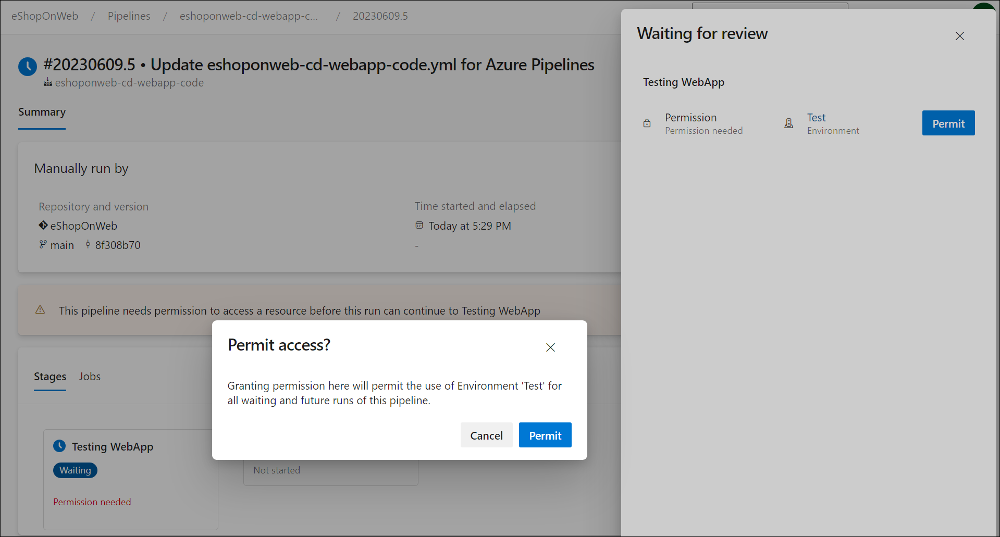

---
lab:
  title: Configurar e validar permissões
  module: 'Module 4: Configure and validate permissions'
---

# Configurar e validar permissões

Neste laboratório, você vai configurar um ambiente seguro que adere ao princípio de privilégios mínimos, garantindo que os membros possam acessar apenas os recursos necessários para executar suas tarefas e minimizar possíveis riscos de segurança. Isso envolve configurar e validar permissões de usuário e pipeline e configurar verificações de aprovação e branch no Azure DevOps.

Estes exercícios levam aproximadamente **30** minutos.

## Antes de começar

Você precisará de uma assinatura do Azure, da organização do Azure DevOps e do aplicativo eShopOnWeb para acompanhar os laboratórios.

- Siga as etapas para [validar seu ambiente de laboratório](APL2001_M00_Validate_Lab_Environment.md).
- Instale um agente auto-hospedado seguindo o laboratório [Configurar agentes e pools de agentes para pipelines seguros](/Instructions/Labs/APL2001_M03_L03_Configure_Agents_And_Agent_Pools_for_Secure_Pipelines.md) ou as etapas em [Instalar um agente auto-hospedado](https://docs.microsoft.com/azure/devops/pipelines/agents/v2-windows?view=azure-devops#install).

## Instruções

### Exercício 1: importar o pipeline de CI e configurar permissões específicas de pipeline

Neste exercício, você importará e executará o pipeline de CI para o aplicativo eShopOnWeb e configurará permissões específicas de pipeline.

#### Tarefa 1: (se concluído, ignorar) importar e executar o pipeline de CI

> [!NOTE]
> Pule a importação se já a tiver feito em outro laboratório.

Comece importando o pipeline de CI chamado [eshoponweb-ci.yml](https://github.com/MicrosoftLearning/eShopOnWeb/blob/main/.ado/eshoponweb-ci.yml).

1. Navegue até o portal do Azure DevOps em `https://dev.azure.com` e abra sua organização.

1. Abra o projeto **eShopOnWeb**.

1. Acesse **Pipelines > Pipelines**.

1. Selecione o botão **Novo pipeline** .

1. Selecione **Git do Azure Repos (Yaml)**.

1. Selecione o repositório **eShopOnWeb**.

1. Selecione **Arquivo YAML existente do Azure Pipelines**.

1. Selecione o arquivo **/.ado/eshoponweb-ci.yml** e selecione **Continuar**.

1. Clique no botão **Executar** para executar o pipeline.

1. Seu pipeline assumirá um nome com base no nome do projeto. Renomeie-o para identificar melhor o pipeline.

1. Vá para **Pipelines > Pipelines**, selecione o pipeline criado recentemente, selecione as reticências e selecione a opção **Renomear/mover**.

1. Nomeie-o **eshoponweb-ci** e selecione **Salvar**.

### Tarefa 2: configurar e executar o pipeline com permissões específicas

Nesta tarefa, você configurará o pipeline de CI para ser executado com um pool de agentes específico e validará as permissões para executar o pipeline. Você precisa ter permissões para editar o pipeline e adicionar permissões ao pool de agentes.

1. Acesse as Configurações do Projeto e clique em **Pools de Agentes** em **Pipelines**.

1. Abra o pool de agentes **Padrão**.

1. Selecione a guia **Segurança**.

1. Se não houver nenhuma restrição no pool de agentes, selecione o botão **Restringir permissões**.

    

1. Selecione o botão **Adicionar** e selecione o pipeline **eshoponweb-ci** para adicioná-lo à lista de pipelines com acesso ao pool de agentes.

1. Clique no botão **Executar** para executar o pipeline.

1. Abra o pipeline em andamento. Se você vir a mensagem "Este pipeline precisa de permissão para acessar um recurso antes que essa execução possa continuar a Criar a solução .Net Core", selecione **Exibir**, **Permitir** e **Permitir** novamente.

Você conseguirá executar o pipeline com êxito.

#### Tarefa 3: (se concluída, pular) configurar o pipeline de CD e validar permissões

> [!NOTE]
> Pule a importação se já a tiver feito em outro laboratório.

> [!IMPORTANT]
> Se você tiver permissões, poderá **Permitir** que o pipeline seja executado diretamente do pipeline em execução. Se você não tiver permissões, precisará usar outra conta com permissões de administração para permitir que seu pipeline seja executado usando o agente específico, conforme descrito na Tarefa 2 anterior, ou para adicionar permissões de usuário ao pool de agentes.

1. Acesse **Pipelines > Pipelines**.

1. Selecione o botão **Novo pipeline**.

1. Selecione **Git do Azure Repos (Yaml)**.

1. Selecione o repositório **eShopOnWeb**.

1. Selecione **Arquivo YAML existente do Azure Pipelines**.

1. Selecione o arquivo **/.ado/eshoponweb-cd-webapp-code.yml** e selecione **Continuar**.

1. Na definição de pipeline YAML, na seção de variáveis, personalize:
   - **YOUR-SUBSCRIPTION-ID** com sua ID de assinatura do Azure.
   - **az400eshop-NAME**, com um nome de aplicativo Web a ser implantado com um nome exclusivo global, por exemplo, **eshoponweb-lab-YOURNAME.**
   - **AZ400-EWebShop-NAME** com o nome de sua preferência, por exemplo, **rg-eshoponweb**.

1. Atualize o arquivo YAML para usar a imagem **windows-latest** no pool de agentes hospedados pela Microsoft **Padrão**. Para isso, defina a seção **pool** com o seguinte valor:

    ```yaml
    pool: 
      vmImage: windows-latest

    ```

1. Selecione **Salvar** e, em seguida, **Executar**.

1. Abra o pipeline e você verá a mensagem "Este pipeline precisa de permissão para acessar um recurso antes que essa execução possa continuar a Implantar o aplicativo Web". Selecione **Exibir** e, em seguida, **Permitir** para permitir a execução do pipeline.

    

### Exercício 2: configurar e validar verificações de aprovação e branch

Neste exercício, você configurará e validará as verificações de aprovação e branch para o pipeline de CD.

#### Tarefa 1: criar um novo ambiente e adicionar aprovações e verificações

1. Vá para **Pipelines > Ambientes**.

1. Selecione o botão **Criar ambiente**.

1. Nomeie o ambiente **Teste**, selecione **Nenhum** como o recurso e selecione **Criar**.

1. Selecione **Novo ambiente**, crie um novo ambiente **Produção**, selecione **Nenhum** como o recurso e selecione **Criar**.

1. Abra o ambiente de **Teste**, selecione ***...*** e **Aprovações e verificações**.

1. Selecione **Approvals**.

1. Na caixa de texto **Aprovadores**, digite seu nome de usuário e, se você tiver outro usuário, adicione-o para validar o processo de aprovação.

1. Dê as instruções **Aprove a implantação para Testar** e selecione **Criar**.

    

1. Selecione o botão **+**, selecione **Controle de branch** e, em seguida, selecione **Avançar**.

1. No campo **Branch permitidos**, deixe o padrão e selecione **Criar**. Você poderá adicionar mais branches se desejar.

    

1. Abra o ambiente de **Produção** e execute as mesmas etapas para adicionar aprovações e controle de branch. Para diferenciar os ambientes, adicione as instruções **Aprove a implantação para Produção** e adicione o branch **refs/heads/main** aos branches permitidos.

1. (Opcional) Você pode adicionar mais ambientes e configurar aprovações e controle de branch para eles. Além disso, você pode configurar a **Segurança** para adicionar usuários ou grupos ao ambiente.
    - Abra o ambiente de **Teste**, selecione ***...*** e selecione **Segurança**.
    - Selecione **Adicionar** e selecione o usuário que está executando o pipeline e a função *Usuário*, *Criador* ou *Leitor*.
    - Selecione **Adicionar**.
    - Clique em **Salvar**.

#### Tarefa 2: configurar o pipeline de CD para usar o novo ambiente

1. Acesse **Pipelines > Pipelines**.

1. Abra o pipeline **eshoponweb-cd-webapp-code**.

1. Selecione **Editar**.

1. Acima do comentário **#baixar artefatos**, adicione:

    ```yaml
    stages:
    - stage: Test
      displayName: Testing WebApp
      jobs:
      - deployment: Test
        pool:
          vmImage: 'windows-latest'
        environment: Test
        strategy:
          runOnce:
            deploy:
              steps:
              - script: echo Hello world! Testing environments!
    - stage: Deploy
    displayName: Deploy to WebApp
      jobs:
      - deployment: Deploy
        pool: 
          vmImage: windows-latest
        environment: Production
        strategy:
          runOnce:
            deploy:
              steps:
              - checkout: self
    ```

    > [!NOTE]
    > Você precisará deslocar as linhas seguindo o código acima seis espaços para a direita para garantir que as regras de recuo YAML sejam atendidas.

    Seu pipeline deve ter esta aparência:

    

1. Selecione **Salvar** e **Executar**.

1. Abra o pipeline e você verá a mensagem "Este pipeline precisa de permissão para acessar um recurso antes que essa execução possa continuar para Testar o WebApp". Selecione **Exibir**, **Permitir** e **Permitir** novamente.

    

1. Abra o estágio **Testar o WebApp** e você verá a mensagem **Uma aprovação precisa de revisão antes que esta execução possa continuar para Testar o WebApp**. Selecione **Revisar** e **Aprovar**.

    

1. Aguarde a conclusão do pipeline, abra o log do pipeline e verifique se a etapa **Testar o WebApp** foi executada com êxito.

    

1. Volte para o pipeline e você verá o estágio **Implantar no WebApp** aguardando aprovação. Selecione **Revisar** e **Aprovar** como fez antes para o estágio **Testar o WebApp**.

1. Aguarde até que o pipeline termine e verifique que o estágio **Implantar no WebApp** foi executado com êxito.

    

Você conseguirá executar o pipeline com êxito com as verificações de aprovações e de branch em ambos os ambientes, de Teste e de Produção.

### Exercício 3: remover os recursos usados neste laboratório

1. No portal do Azure, abra o grupo de recursos criado e clique em **Excluir grupo de recursos** para todos os recursos criados neste laboratório.

    

    > [!WARNING]
    > Lembre-se sempre de remover todos os recursos do Azure que você não usa mais. Remover recursos não utilizados garante que você não veja encargos inesperados.

1. Redefina as permissões específicas adicionadas à organização e ao projeto do Azure DevOps neste laboratório.

## Revisão

Neste laboratório, você aprendeu a configurar um ambiente seguro que adere ao princípio de privilégios mínimos, garantindo que os membros possam acessar apenas os recursos necessários para executar as tarefas deles e minimizar possíveis riscos de segurança. Você configurou e validou permissões de usuário e pipeline e configurou verificações de aprovação e branch no Azure DevOps.
