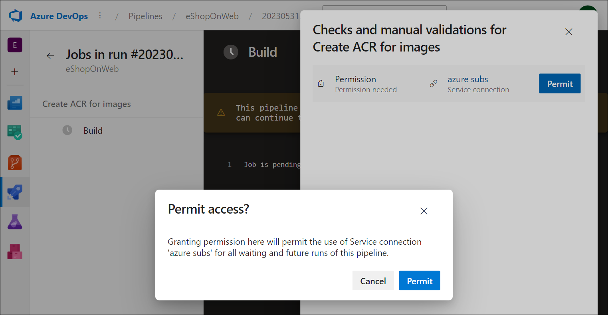

---
lab:
  title: Integrar o Azure Key Vault ao Azure Pipelines
  module: 'Module 6: Configure secure access to Azure Repos from pipelines'
---

# Integrar o Azure Key Vault ao Azure Pipelines

O Azure Key Vault fornece armazenamento seguro e gerenciamento de dados confidenciais, como chaves, senhas e certificados. O Azure Key Vault inclui suporte para módulos de segurança de hardware e uma variedade de algoritmos de criptografia e comprimentos de chave. O uso do Azure Key Vault pode minimizar a possibilidade de divulgação de dados confidenciais por meio do código-fonte, um erro comum cometido pelos desenvolvedores. O acesso ao Azure Key Vault requer autenticação e autorização adequadas, dando suporte a permissões refinadas para seu conteúdo.

Este exercício leva aproximadamente **40** minutos.

## Antes de começar

Você precisará de uma assinatura do Azure, da organização do Azure DevOps e do aplicativo eShopOnWeb para acompanhar os laboratórios.

- Siga as etapas para [validar seu ambiente de laboratório](APL2001_M00_Validate_Lab_Environment.md).

Neste laboratório, você aproveitará a entidade de serviço criada ao validar seu ambiente de laboratório para:

- Implantar recursos na assinatura do Azure
- Obter acesso de leitura aos segredos do Azure Key Vault.

## Instruções

Neste laboratório, você verá como integrar o Azure Key Vault ao Azure Pipelines usando as seguintes etapas:

- Criar um Azure Key Vault para armazenar uma senha do ACR como um segredo.
- Configurar permissões para permitir que a entidade de serviço leia o segredo.
- Configurar o pipeline para recuperar a senha do Azure Key Vault e passá-la para tarefas posteriores.

### Exercício 1: Configurar o pipeline de CI para criar um contêiner eShopOnWeb

Neste exercício, você configurará um pipeline CI YAML para:

- Criar um Registro de Contêiner do Azure para armazenar as imagens de contêiner
- Usar o Docker Compose para criar e enviar por push as  imagens de contêiner **eshoppublicapi** e **eshopwebmvc**. Somente o contêiner **eshopwebmvc** será implantado.

#### Tarefa 1: Configurar e executar o pipeline de CI

Nesta tarefa, você importará uma definição de pipeline CI YAML existente, a modificará e a executará. O pipeline criará um Registro de Contêiner do Azure (ACR) e criará/publicará as imagens de contêiner eShopOnWeb.

1. Navegue até o portal do Azure DevOps em `https://dev.azure.com` e abra sua organização.

1. Navegue até o projeto **eShopOnWeb** do Azure DevOps. Vá para **Pipelines> Pipelines** e selecione **Criar pipeline**.

1. Na página **Onde está seu código?**, selecione **Git do Azure Repos (YAML)** e selecione o repositório **eShopOnWeb**.

1. Na página **Configurar seu pipeline**, selecione **Arquivo YAML existente do Azure Pipelines**. Forneça o seguinte caminho **/.ado/eshoponweb-ci-dockercompose.yml** e selecione **Continuar**.

   

1. Na definição de pipeline do YAML, na seção variáveis, execute as seguintes ações:

   - substitua **AZ400-EWebShop-NAME** por **rg-eshoponweb-docker**
   - defina o valor da variável de localização como o nome da região do Azure que você usou nos laboratórios anteriores deste curso (por exemplo, **southcentralus**)
   - substitua **YOUR-SUBSCRIPTION-ID** por sua Id de assinatura do Azure.

1. Selecione **Salvar e executar** e escolha fazer commit diretamente na ramificação principal.

1. Selecione **Salvar e executar** novamente.

   > [!NOTE]
   > Se você optar por criar uma nova ramificação, será necessário criar uma solicitação de pull para mesclar as alterações na ramificação principal.

1. Abra o pipeline. Se você vir a mensagem “Este pipeline precisa de permissão para acessar um recurso antes que essa execução possa continuar no Docker Compose para WebApp”, selecione **Exibir**, **Permitir** e **Permitir** novamente. Isso é necessário para permitir que o pipeline crie os recursos do Azure.

   

1. Aguarde a conclusão da execução de pipeline. Isso pode levar alguns minutos. A definição de compilação consiste nas seguintes tarefas:

     - **AzureResourceManagerTemplateDeployment** usa **bicep** para criar um registro de Contêiner do Azure.
     - A tarefa **PowerShell** obtém a saída do bicep (servidor de logon do acr) e cria a variável de pipeline.
     - A tarefa **DockerCompose** compila e envia por push as imagens de contêiner para eShopOnWeb para o Registro de Contêiner do Azure.

1. Por padrão, o pipeline terá o nome com base no nome do projeto. Renomeie-o para ** eshoponweb-ci-dockercompose** para identificar melhor o pipeline.

1. Depois que a execução do pipeline for concluída, use o navegador da Web para navegar até o Portal do Azure, abra o grupo de recursos **rg-eshoponweb-docker** e selecione a entrada que representa o ACR (Registro de Contêiner do Azure) implantado pelo pipeline.

   > [!NOTE]
   > Para exibir repositórios no registro, você precisa conceder à sua conta de usuário uma função que forneça esse acesso. Você usará para essa finalidade a função AcrPull.

1. Na página Registro de Contêiner, selecione **Controle de acesso (IAM),** selecione **+ Adicionar** e, no menu suspenso, selecione **Adicionar atribuição de função**.

1. Na guia **Função** da página **Adicionar atribuição de função**, selecione **AcrPull** e selecione **Avançar**.

1. Na guia **Membros**, clique em **+ Selecionar membros**, selecione sua conta de usuário, clique em **Selecionar** e selecione **Avançar**.

1. Selecione **Revisar + atribuir** e, quando a atribuição for concluída com êxito, atualize a página do navegador.

1. De volta à página Registro de Contêiner, na barra de menus vertical à esquerda, na seção **Serviços**, selecione **Repositórios**.

1. Verifique se o registro contém as imagens **eshoppublicapi** e **eshopwebmvc**. Você usará **eshopwebmvc** apenas na fase de implantação.

   

1. Selecione **Chaves de Acesso**, habilite a caixa de seleção **Usuário administrador** e copie o valor de **senha**, que será usado na tarefa a seguir, pois você a adicionará como um segredo ao Azure Key Vault.

   

1. Na mesma página, registre o valor do **nome do Registro**. Você precisará disso em uma etapa posterior deste laboratório.

#### Tarefa 2: criar um Azure Key Vault

Nesta tarefa, você criará um Azure Key vault usando o portal do Azure.

Para esse cenário de laboratório, teremos uma ACI (Instância de Contêiner do Azure) que efetua pull e executa uma imagem de contêiner armazenada no ACR (Registro de Contêiner do Azure). Pretendemos armazenar a senha do ACR como um segredo no Azure Key Vault.

1. No portal do Azure, na caixa de texto **Pesquisar recursos, serviços e documentos**, digite **Cofre de chaves** e pressione **Enter**.

1. Selecione a folha **Cofres de chaves**, clique em **Criar > Cofre de chaves**.

1. Na guia **Noções básicas** da folha **Criar cofre de chaves**, especifique as seguintes configurações e clique em **Avançar**:

   | Configuração | Valor |
   | --- | --- |
   | Assinatura | o nome da assinatura do Azure que você está usando neste laboratório |
   | Grupo de recursos | o nome do grupo de recursos **rg-eshoponweb-docker** |
   | Nome do cofre de chaves | qualquer nome válido exclusivo, como **ewebshop-kv-** seguido por um número aleatório de seis dígitos |
   | Region | a mesma região do Azure usada anteriormente neste laboratório |
   | Tipo de preço | **Standard** |
   | Dias de retenção dos cofres excluídos | **7** |
   | Proteção contra limpeza | **Desabilitar proteção contra limpeza** |

1. Na guia **Configuração de acesso** da folha **Criar cofre de chaves**, na seção **Modelo de permissão**, selecione **Política de acesso do cofre**. 

1. Na seção **Políticas de acesso**, selecione **+ Criar** para configurar uma nova política.

   > **Observação**: você precisa proteger o acesso aos cofres de chaves permitindo apenas aplicativos e usuários autorizados. Para acessar os dados do cofre, você precisará fornecer permissões de leitura (Obter/Listar) para a entidade de serviço criada anteriormente que será usada para autenticação no pipeline.

   - Na folha **Permissão**, marque as permissões **Obter** e **Listar** abaixo de ** Permissão de segredo**. Selecione **Avançar**.
   - Na folha **Entidade**, pesquise a entidade de serviço que você criou ao validar seu ambiente de laboratório, usando sua ID ou nome. Selecione **Avançar** e **Avançar** novamente.
   - Na página **Revisar + Criar**, selecione **Criar**.

1. De volta à folha **Criar um cofre de chaves** , selecione **Revisar + Criar > Criar**

   > [!NOTE]
   > Aguarde até que o cofre de Chaves do Azure seja provisionado. Isso deverá levar menos de 1 minuto.

1. Na folha **A implantação foi concluída**, selecione **Ir para o recurso**.

1. Na folha Cofre de Chaves do Azure, no menu vertical no lado esquerdo da folha, na seção **Objetos**, selecione **Segredos**.

1. Na folha **Segredos**, selecione **Gerar/Importar**.

1. Na folha **Criar um segredo**, especifique as seguintes configurações e selecione **Criar** (deixe as demais com seus valores padrão):

   | Configuração | Valor |
   | --- | --- |
   | Opções de upload | **Manual** |
   | Nome | **acr-secret** |
   | Valor | Senha de acesso do ACR copiada na tarefa anterior |

#### Tarefa 3: criar um grupo de variáveis conectado ao cofre de segredos do Azure

Nesta tarefa, você criará um Grupo de variáveis no Azure DevOps que recuperará o segredo da senha do ACR no Cofre de chaves usando a Conexão de serviço (entidade de serviço)

1. Navegue até o portal do Azure DevOps em `https://dev.azure.com` e abra sua organização.

1. Navegue até o projeto **eShopOnWeb** do Azure DevOps.

1. No painel de navegação vertical do portal do Azure DevOps, selecione **Pipelines > Biblioteca**. Selecione **+ Grupo de variáveis**.

1. Na folha **Novo grupo de variáveis**, especifique as seguintes configurações:

   | Configuração | Valor |
   | --- | --- |
   | Nome do grupo de variáveis | **eshopweb-vg** |
   | Vincular segredos do Azure key vault como variáveis | **enable** |
   | Assinatura do Azure | **Conexão de serviço do Azure disponível > subs do azure** |
   | Nome do cofre de chaves | o nome atribuído ao Azure Key Vault na tarefa anterior |

1. Em **Variáveis**, selecione **+ Adicionar** e selecione o segredo **acr-secret**. Selecione **OK**.

1. Selecione **Salvar**.

   

#### Tarefa 4: configurar o pipeline de CD para implantar o contêiner na ACI (Instância de Contêiner) do Azure

Nesta tarefa, você importará um pipeline de CD, personalizará-o e executará-o para implantar a imagem de contêiner criada anteriormente em uma Instância de Contêiner do Azure.

1. No portal do Azure DevOps exibindo o projeto **eShopOnWeb**, selecione **Pipelines > Pipelines** e selecione **Novo pipeline**.

1. Na página **Onde está seu código?**, selecione **Git do Azure Repos (YAML)** e selecione o repositório **eShopOnWeb**.

1. Na página **Configurar seu pipeline**, selecione **Arquivo YAML existente do Azure Pipelines**. Forneça o caminho **/.ado/eshoponweb-cd-aci.yml** e selecione **Continuar**.

1. Na definição de pipeline do YAML, na seção da variável, execute as seguintes ações:

   - defina o valor da variável de localização como o nome de uma região do Azure que você usou anteriormente neste laboratório
   - substitua **YOUR-SUBSCRIPTION-ID** por sua Id de assinatura do Azure.
   - substitua **az400eshop-NAME** por um nome globalmente exclusivo da instância de Contêiner do Azure a ser implantado, por exemplo, a cadeia de caracteres **eshoponweb-lab-docker-** seguida por um número aleatório de seis dígitos. 
   - substitua **YOUR-ACR** e **ACR-USERNAME** pelo nome do registro do ACR que você registrou anteriormente neste laboratório.
   - substitua **AZ400-EWebShop-NAME** pelo nome do grupo de recursos que você criou anteriormente neste laboratório (**rg-eshoponweb-docker**).

1. Selecione **Salvar e Executar** e, em seguida, selecione **Salvar e Executar** novamente.

1. Abra o pipeline e observe a mensagem “Este pipeline precisa de permissão para acessar dois recursos antes que essa execução possa continuar com Docker Compose para ACI”. Selecione **Exibir** e selecione **Permitir** duas vezes (para cada recurso) para permitir que o pipeline seja executado.

1. Aguarde a conclusão da execução de pipeline. Isso pode levar alguns minutos. A definição de build consiste em uma única tarefa **AzureResourceManagerTemplateDeployment**, que implanta a ACI (Instância de Contêiner do Azure) usando um modelo bicep e fornece os parâmetros de logon do ACR para permitir que a ACI baixe a imagem de contêiner criada anteriormente.

1. Seu pipeline assumirá um nome com base no nome do projeto. Renomeie-a para **eshoponweb-cd-aci** para facilitar a identificação de sua finalidade.

### Exercício 2: executar a limpeza dos recursos do Azure e do Azure DevOps

Neste exercício, você removerá os recursos do Azure e do Azure DevOps criados neste laboratório.

#### Tarefa 1: remover recursos do Azure

1. No portal do Azure, navegue até o grupo de recursos **rg-eshoponweb-docker** que contém recursos implantados e selecione **Excluir grupo de recursos** para excluir todos os recursos criados neste laboratório.

#### Tarefa 2: remover pipelines do Azure DevOps

1. Navegue até o portal do Azure DevOps em `https://dev.azure.com` e abra sua organização.

1. Abra o projeto **eShopOnWeb**.

1. Acesse **Pipelines > Pipelines**.

1. Vá para **Pipelines > Pipelines** e exclua os pipelines existentes.

#### Tarefa 3: Recriar o repositório do Azure DevOps

1. No portal do Azure DevOps, no projeto **eShopOnWeb**, selecione **Configurações do projeto** no canto inferior esquerdo.

1. No menu vertical **Configurações do projeto** ao lado esquerdo, na seção **Repositórios**, selecione **Repositórios**.

1. No painel **Todos os Repositórios**, passe o mouse sobre a extremidade direita da entrada do repositório **eShopOnWeb** até que o ícone de reticências **Mais opções** apareça. Selecione-o e, no menu **Mais opções**, selecione **Renomear**.  

1. Na janela **Renomear o repositório eShopOnWeb**, na caixa de texto **Nome do repositório**, insira **eShopOnWeb_old** e selecione **Renomear**.

1. De volta ao painel **Todos os Repositórios**, selecione **+ Criar**.

1. No painel **Criar um repositório**, na caixa de texto **Nome do repositório**, insira **eShopOnWeb**, desmarque a caixa de seleção **Adicionar um LEIAME** e selecione **Criar**.

1. De volta ao painel **Todos os Repositórios**, passe o mouse sobre a extremidade direita da entrada do repositório **eShopOnWeb_old** até que o ícone de reticências **Mais opções** apareça. Selecione-o e, no menu **Mais opções**, selecione **Excluir**.  

1. Na janela **Excluir o repositório eShopOnWeb_old**, insira **eShopOnWeb_old** e selecione **Excluir**.

1. No menu de navegação esquerdo do portal do Azure DevOps, selecione **Repositórios**.

1. No painel **eShopOnWeb está vazio. Adicione algum código!** selecione **Importar um repositório**.

1. Na janela **Importar um repositório do Git**, cole a seguinte URL `https://github.com/MicrosoftLearning/eShopOnWeb` e selecione **Importar**:

## Revisão

Neste laboratório, você integrou um Azure Key Vault a um pipeline do Azure DevOps usando as seguintes etapas:

- Usou uma entidade de serviço do Azure para fornecer acesso aos segredos do Azure Key Vault e aos recursos do Azure no Azure DevOps.
- Executou dois pipelines YAML importados de um repositório do Git.
- Configurou o pipeline para recuperar a senha do Azure Key Vault usando um grupo de variáveis e reutilizou-a em tarefas subsequentes.
