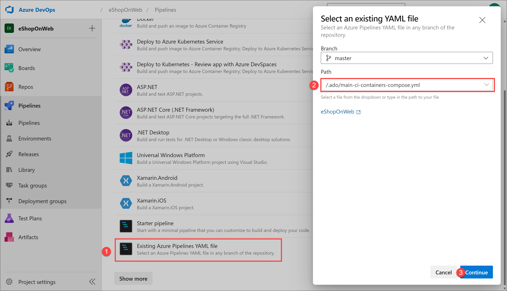

---
lab:
  title: Integrar o Azure Key Vault ao Azure Pipelines
  module: 'Module 6: Configure secure access to Azure Repos from pipelines'
---

# Integrar o Azure Key Vault ao Azure Pipelines

O Azure Key Vault fornece armazenamento seguro e gerenciamento de dados confidenciais, como chaves, senhas e certificados. O Azure Key Vault inclui suporte para módulos de segurança de hardware e uma variedade de algoritmos de criptografia e comprimentos de chave. O uso do Azure Key Vault pode minimizar a possibilidade de divulgação de dados confidenciais por meio do código-fonte, um erro comum cometido pelos desenvolvedores. O acesso ao Azure Key Vault requer autenticação e autorização adequadas, dando suporte a permissões refinadas para seu conteúdo.

Este exercício leva aproximadamente **40** minutos.

## Antes de começar

Você precisará de uma assinatura do Azure, da organização do Azure DevOps e do aplicativo eShopOnWeb para acompanhar os laboratórios.

- Siga as etapas para [validar seu ambiente de laboratório](APL2001_M00_Validate_Lab_Environment.md).

## Instruções

Neste laboratório, você verá como integrar o Azure Key Vault ao Azure Pipelines usando as seguintes etapas:

- Criar um Azure Key Vault para armazenar uma senha do ACR como um segredo.
- Criar uma entidade de serviço do Azure para acessar os segredos do Azure Key Vault.
- Configurar permissões para permitir que a entidade de serviço leia o segredo.
- Configurar o pipeline para recuperar a senha do Azure Key Vault e passá-la para tarefas posteriores.

### Exercício 1: Configurar o pipeline de CI para criar um contêiner eShopOnWeb

Configurar o pipeline YAML de CI para:

- Criar um Registro de Contêiner do Azure para manter as images do contêiner
- Usar o Docker Compose para criar e enviar por push as  imagens de contêiner **eshoppublicapi** e **eshopwebmvc**. Somente o contêiner **eshopwebmvc** será implantado.

#### Tarefa 1: (pular se feita) criar uma entidade de serviço

Nesta tarefa, você criará uma entidade de serviço usando a CLI do Azure, que permitirá ao Azure DevOps:

- Implantar recursos na assinatura do Azure
- Ter acesso de leitura sobre os segredos do Key Vault criados posteriormente.

Você precisará de uma entidade de serviço para implantar recursos do Azure a partir do Azure Pipelines. Como você recuperará segredos em um pipeline, precisará conceder permissão ao serviço quando criarmos o Azure Key Vault.

O Azure Pipelines cria automaticamente uma entidade de serviço quando você se conecta a uma assinatura do Azure de dentro de uma definição de pipeline ou quando cria uma nova Conexão de Serviço na página de configurações do projeto (opção automática). Você também pode criar manualmente a entidade de serviço a partir do portal ou usar a CLI do Azure e reutilizá-la em projetos.

1. Abra o navegador da Web, navegue até o portal do Azure em `https://portal.azure.com` e entre com a conta de usuário que tenha a função de Proprietário na assinatura do Azure que você usará neste laboratório e a função de Administrador Global no locatário do Azure AD associada a essa assinatura.

1. No portal do Azure, clique no ícone do **Cloud Shell** , localizado diretamente à direita da caixa de texto de pesquisa na parte superior da página.

1. Se for solicitado que você selecione **Bash** ou **PowerShell**, selecione **Bash**.

   > [!NOTE]
   > Se esta for a primeira vez que você estiver iniciando o **Cloud Shell** e receber a mensagem **Você não tem nenhum armazenamento montado**, selecione a assinatura que você está usando no laboratório e selecione **Criar armazenamento**.

1. No prompt **Bash**, no painel **Cloud Shell**, execute os seguintes comandos para recuperar os valores da ID de assinatura do Azure e dos atributos de nome de assinatura:

    ```bash
    az account show --query id --output tsv
    az account show --query name --output tsv
    ```

    > [!NOTE]
    > Copie ambos os valores para um arquivo de texto. Você precisará deles mais adiante neste laboratório.

1. No prompt **Bash**, no painel **Cloud Shell**, execute o seguinte comando para criar uma entidade de serviço (substitua myServicePrincipalName** por qualquer cadeia de caracteres exclusiva que consista em letras e dígitos**) e **mySubscriptionID** por sua subscriptionId do Azure:

    ```bash
    az ad sp create-for-rbac --name myServicePrincipalName \
                         --role contributor \
                         --scopes /subscriptions/mySubscriptionID
    ```

    > [!NOTE]
    > O comando gerará uma saída JSON. Copie a saída no arquivo de texto. Você precisará disso em uma etapa posterior deste laboratório.

1. Em seguida, navegue até o portal do Azure DevOps em `https://dev.azure.com` e abra sua organização.

1. Navegue até o projeto **eShopOnWeb** do Azure DevOps. Selecione **Configurações do projeto > Conexões de serviço (em Pipelines)** e **Nova conexão de serviço**.

    

1. Na folha **Nova conexão de serviço**, escolha **Azure Resource Manager** e **Avançar** (talvez seja necessário rolar para baixo).

1. Depois selecione **Entidade de serviço (manual)** e **Avançar**.

1. Preencha os campos vazios usando as informações coletadas durante as etapas anteriores:
    - ID e nome da assinatura.
    - ID da entidade de serviço (ou clientId/AppId), chave da entidade de serviço (ou senha) e TenantId.
    - Em **Nome da conexão de serviço**, digite **azure subs**. Esse nome será referenciado em pipelines YAML quando precisar de uma Conexão de Serviço do Azure DevOps para se comunicar com sua assinatura do Azure.

        

1. Não marque **Conceder permissão de acesso a todos os pipelines**. Selecione **Verificar e salvar**.

    > [!NOTE]
    > A opção **Conceder permissão de acesso a todos os pipelines** não é recomendada para ambientes de produção. Ela só é usada neste laboratório para simplificar a configuração do pipeline.

#### Tarefa 2: configurar e executar o pipeline de CI

Nesta tarefa, você importará, modificará e executará uma definição de pipeline YAML de CI existente. Ela criará um novo Registro de Contêiner do Azure (ACR) e criará/publicará as imagens de contêiner do eShopOnWeb.

1. Navegue até o portal do Azure DevOps em `https://dev.azure.com` e abra sua organização.

1. Navegue até o projeto **eShopOnWeb** do Azure DevOps. Vá para **Pipelines > Pipelines** e clique em **Criar pipeline** (ou **Novo pipeline**).

1. Na janela **Onde está seu código?**, selecione **Azure Repos Git (YAML)** e selecione o repositório **eShopOnWeb**.

1. Na seção **Configurar**, escolha **Arquivo YAML existente do Azure Pipelines**. Forneça o seguinte caminho **/.ado/eshoponweb-ci-dockercompose.yml** e selecione **Continuar**.

    

1. Na definição de pipeline YAML, na seção variáveis, personalize o nome do Grupo de Recursos substituindo **AZ400-EWebShop-NAME** pelo nome de sua preferência, por exemplo,**rg-eshoponweb**. Substitua **YOUR-SUBSCRIPTION-ID** por seu próprio subscriptionId do Azure e escolha o local de sua preferência mais próximo de seu local, por exemplo **southcentralus**.

1. (Opcional) Você pode usar o agente auto-hospedado criado no laboratório anterior atualizando o nome do pool atualmente definido para o agente hospedado pela Microsoft para o nome do pool de agentes que você criou, **eShopOnWebSelfPool**.

    Em vez de:

    ```YAML
      - job: Build
        pool:
          vmImage: ubuntu-latest
    
    ```

    Use:

    ```YAML
      - job: Build
        pool: eShopOnWebSelfPool
    
    ```

    > [!NOTE]
    > Para executar o pipeline com o agente auto-hospedado, você precisará ter o agente em execução e todos os pré-requisitos instalados, por exemplo, o Visual Studio para criar a solução. Se você não tiver os pré-requisitos instalados, poderá usar o agente hospedado pela Microsoft.

1. Selecione **Salvar e executar** para confirmar diretamente na ramificação principal ou crie uma ramificação para essa confirmação.

1. Selecione **Salvar e executar** novamente.

    > [!NOTE]
    > Se você optar por criar uma nova ramificação, será necessário criar uma solicitação de pull para mesclar as alterações na ramificação principal.

1. Abra o pipeline. Se você vir a mensagem "Este pipeline precisa de permissão para acessar um recurso antes que essa execução possa continuar a Criar ACR para imagens", selecione **Exibir**, **Permitir** e **Permitir** novamente. Isso é necessário para permitir que o pipeline crie o recurso do Registro de Contêiner do Azure (ACR).

    

1. A compilação pode levar alguns minutos para ser concluída, aguarde a execução do pipeline. A definição de compilação consiste nas seguintes tarefas:
      - **AzureResourceManagerTemplateDeployment** usa **bicep** para implantar um Registro de Contêiner do Azure.
      - A tarefa **PowerShell** obtém a saída do bicep (servidor de logon do acr) e cria a variável de pipeline.
      - A tarefa **DockerCompose** cria e envia as imagens de contêiner do eShopOnWeb para o Registro de Contêiner do Azure.

1. Seu pipeline assumirá um nome com base no nome do projeto. Renomeie-o para identificar melhor o pipeline.

1. Vá para **Pipelines > Pipelines** no pipeline criado recentemente, passe o mouse sobre o pipeline executado e selecione as reticências e a opção **Renomear/mover**.

1. Nomeie-o **eshoponweb-ci-dockercompose** e selecione **Salvar**.

1. Quando a execução for concluída, no portal do Azure, abra o Grupo de Recursos definido anteriormente e selecione a entrada que representa o Registro de Contêiner do Azure (ACR) implantado pelo pipeline.

    > [!NOTE]
    > Para exibir repositórios no Registro, você precisa atribuir uma função que forneça esse acesso. Você usará para essa finalidade a função AcrPull.

1. Na página Registro de Contêiner, selecione **Controle de acesso (IAM),** selecione **+ Adicionar** e, no menu suspenso, selecione **Adicionar atribuição de função**.

1. Na guia **Função** da página **Adicionar atribuição de função**, selecione **AcrPull** e selecione **Avançar**.

1. Na guia **Membros**, clique em **+ Selecionar membros**, selecione sua conta de usuário, clique em **Selecionar** e selecione **Avançar**.

1. Selecione **Revisar + atribuir** e, quando a atribuição for concluída com êxito, atualize a página do navegador.

1. De volta à página Registro de Contêiner, na barra de menus vertical à esquerda, na seção **Serviços**, selecione **Repositórios**.

1. Verifique se o registro contém as imagens **eshoppublicapi** e **eshopwebmvc**. Você usará **eshopwebmvc** apenas na fase de implantação.

    

1. Selecione **Chaves de Acesso**, habilite a caixa de seleção **Usuário administrador** e copie o valor **senha**, que será usado na tarefa a seguir, pois o manteremos como um segredo no Azure Key Vault.

    

#### Tarefa 3: criar um Azure Key Vault

Nesta tarefa, você criará um Azure Key Vault usando o portal do Azure.

Para esse cenário de laboratório, teremos uma Instância de Contêiner (ACI) do Azure que extrai e executa uma imagem de contêiner armazenada no Registro de Contêiner do Azure (ACR). Pretendemos armazenar a senha do ACR como um segredo no cofre de chaves.

1. No portal do Azure, na caixa de texto **Pesquisar recursos, serviços e documentos**, digite **Cofre de chaves** e pressione **Enter**.

1. Selecione a folha **Cofres de chaves**, clique em **Criar > Cofre de chaves**.

1. Na guia **Noções básicas** da folha **Criar cofre de chaves**, especifique as seguintes configurações e clique em **Avançar**:

    | Configuração | Valor |
    | --- | --- |
    | Subscription | o nome da assinatura do Azure que você está usando neste laboratório |
    | Grupo de recursos | o nome do grupo de recursos **rg-eshoponweb** |
    | Nome do cofre de chaves | qualquer nome válido exclusivo, como **ewebshop-kv-NAME (substitua NAME** ) |
    | Region | uma região do Azure próxima do local do seu ambiente de laboratório |
    | Tipo de preço | **Padrão** |
    | Dias de retenção dos cofres excluídos | **7** |
    | Proteção contra limpeza | **Desabilitar proteção contra limpeza** |

1. Na guia **Configuração de acesso** da folha **Criar cofre de chaves**, na seção **Modelo de permissão**, selecione **Política de acesso do cofre**. 

1. Na seção **Políticas de acesso**, selecione **+ Criar** para configurar uma nova política.

    > **Observação**: você precisa proteger o acesso aos cofres de chaves permitindo apenas aplicativos e usuários autorizados. Para acessar os dados do cofre, você precisará fornecer permissões de leitura (Obter/Listar) para a entidade de serviço criada anteriormente que será usada para autenticação no pipeline.

    - Na folha **Permissão**, marque as permissões **Obter** e **Listar** abaixo de ** Permissão de segredo**. Selecione **Avançar**.
    - Na folha **Entidade de serviço**, procure a **Entidade de serviço** criada anteriormente, usando a ID ou o Nome fornecidos. Selecione **Avançar** e **Avançar** novamente.
    - Na página **Revisar + Criar**, selecione **Criar**.

1. De volta à folha **Criar um cofre de chaves** , selecione **Revisar + Criar > Criar**

    > [!NOTE]
    > Aguarde até que o cofre de Chaves do Azure seja provisionado. Isso deverá levar menos de 1 minuto.

1. Na folha **A implantação foi concluída**, selecione **Ir para o recurso**.

1. Na folha Cofre de Chaves do Azure, no menu vertical no lado esquerdo da folha, na seção **Objetos**, selecione **Segredos**.

1. Na folha **Segredos**, selecione **Gerar/Importar**.

1. Na folha **Criar um segredo**, especifique as seguintes configurações e selecione **Criar** (deixe as demais com seus valores padrão):

    | Configuração | Valor |
    | --- | --- |
    | Opções de upload | **Manual** |
    | Nome | **acr-secret** |
    | Valor | Senha de acesso do ACR copiada na tarefa anterior |

#### Tarefa 3: criar um grupo de variáveis conectado ao cofre de segredos do Azure

Nesta tarefa, você criará um Grupo de variáveis no Azure DevOps que recuperará o segredo da senha do ACR no Cofre de chaves usando a Conexão de serviço (entidade de serviço)

1. Navegue até o portal do Azure DevOps em `https://dev.azure.com` e abra sua organização.

1. Navegue até o projeto **eShopOnWeb** do Azure DevOps.

1. No painel de navegação vertical do portal do Azure DevOps, selecione **Pipelines > Biblioteca**. Selecione **+ Grupo de variáveis**.

1. Na folha **Novo grupo de variáveis**, especifique as seguintes configurações:

    | Configuração | Valor |
    | --- | --- |
    | Nome do grupo de variáveis | **eshopweb-vg** |
    | Vincular segredos pelo Azure KV ... | **enable** |
    | Assinatura do Azure | **Conexão de serviço do Azure disponível > Ass do Azure** |
    | Nome do cofre de chaves | O nome do cofre de chaves|

1. Em **Variáveis**, selecione **+ Adicionar** e selecione o segredo **acr-secret**. Selecione **OK**.

1. Selecione **Salvar**.

    

#### Tarefa 4: configurar o pipeline de CD para implantar o contêiner na ACI (Instância de Contêiner) do Azure

Nesta tarefa, você importará, personalizará e executará um pipeline de CD para implantar a imagem de contêiner criada anteriormente em uma Instância de Contêiner do Azure.

1. Navegue até o portal do Azure DevOps em `https://dev.azure.com` e abra sua organização.

1. Navegue até o projeto **eShopOnWeb** do Azure DevOps. Acesse **Pipelines > Pipelines** e selecione **Novo pipeline**.

1. Na janela **Onde está seu código?**, selecione **Azure Repos Git (YAML)** e selecione o repositório **eShopOnWeb**.

1. Na seção **Configurar**, escolha **Arquivo YAML existente do Azure Pipelines**. Forneça o seguinte caminho **/.ado/eshoponweb-cd-aci.yml** e selecione **Continuar**.

1. Na definição de pipeline YAML, personalize:

    - **YOUR-SUBSCRIPTION-ID** com sua ID de assinatura do Azure.
    - **az400eshop-NAME** substitua NAME para torná-lo globalmente único.
    - **YOUR-ACR.azurecr.io** e **ACR-USERNAME** com seu servidor de login do ACR (ambos precisam do nome do ACR, pode ser revisado no ACR > Chaves de acesso).
    - **rg-eshoponweb** com o nome do grupo de recursos definido antes no laboratório.

1. Selecione **Salvar e executar** e aguarde até que o pipeline seja executado com êxito.

    > **Observação**: a implantação pode levar alguns minutos para ser concluída. A definição de CD consiste nas seguintes tarefas:
    - **Recursos**: é preparado para acionar automaticamente com base na conclusão do pipeline de CI. Também faz o download do repositório para o arquivo bicep.
    - **Variáveis (para o estágio Implantar)** se conecta ao grupo de variáveis para consumir o segredo **acr-secret** do Azure Key Vault.
    - **AzureResourceManagerTemplateDeployment** implanta a Instância de Contêiner do Azure (ACI) usando o modelo bicep e fornece os parâmetros de logon do ACR para permitir que a ACI baixe a imagem de contêiner criada anteriormente do Registro de Contêiner do Azure (ACR).

1. Seu pipeline assumirá um nome com base no nome do projeto. Renomeie-o para identificar melhor o pipeline.

1. Vá para **Pipelines > Pipelines**, selecione o pipeline criado recentemente, selecione as reticências e selecione a opção **Renomear/mover**.

1. Nomeie-o **eshoponweb-cd-aci** e selecione **Salvar**.

### Exercício 2: remover os recursos de laboratório do Azure

1. No portal do Azure, abra o Grupo de recursos criado e clique em **Excluir grupo de recursos**.

    

    > [!WARNING]
    > Lembre-se sempre de remover todos os recursos do Azure que você não usa mais. Remover recursos não utilizados garante que você não veja encargos inesperados.

## Revisão

Neste laboratório, você integrou um Azure Key Vault a um pipeline do Azure DevOps usando as seguintes etapas:

- Criou uma entidade de serviço do Azure para fornecer acesso aos segredos do Azure Key Vault e autenticar a implantação do Azure a partir do Azure DevOps.
- Executou dois pipelines YAML importados de um repositório Git.
- Configurou o pipeline para recuperar a senha do Azure Key Vault usando o grupo de variáveis ADO e o usuou em tarefas posteriores.
